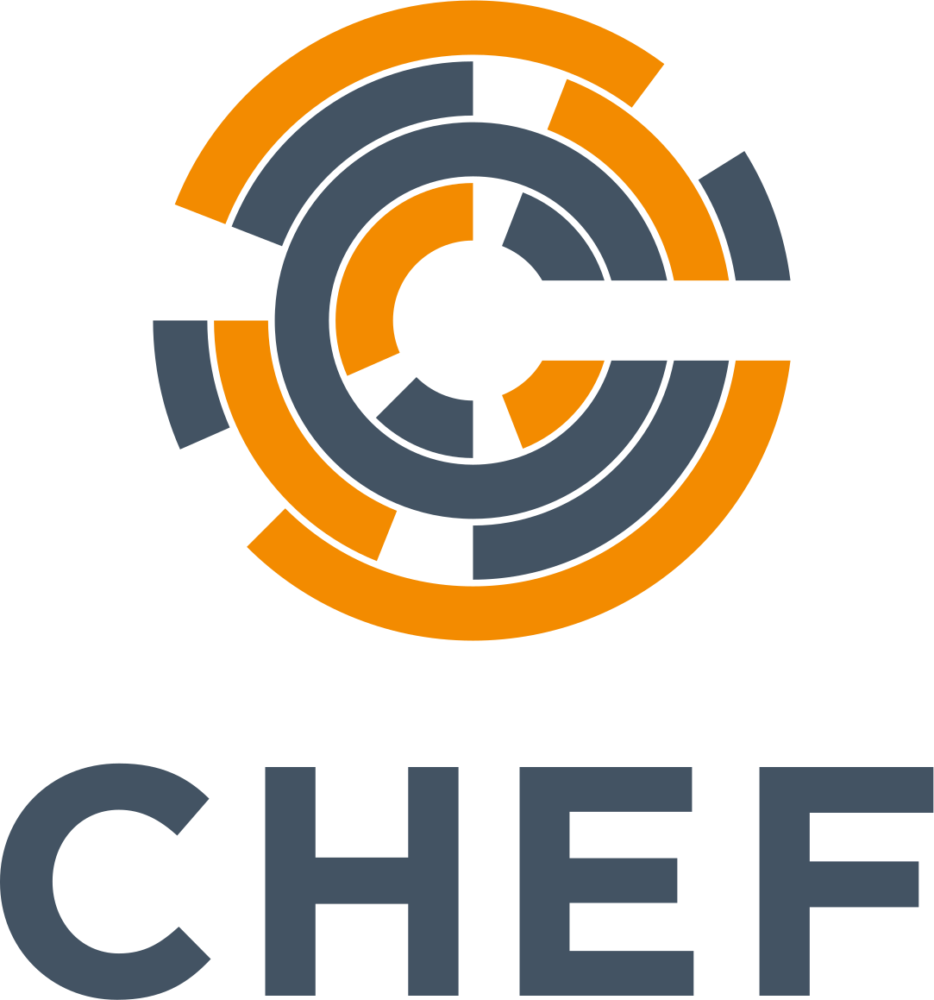

# drone-chef-client


[](https://discourse.drone.io)
[](https://stackoverflow.com/questions/tagged/drone.io)
[](http://godoc.org/github.com/drone-plugins/drone-s3-cache)

Drone plugin that allows you to run chef client on assign nodes.

## Vendor dependency

Generaget golang deps (install `Dep` first)
install `dep`

```sh
brew install dep
```

dep init or update

```sh
dep init
dep ensure
```

## Build

Build the binary with the following commands:

```sh
go build
```

## Docker

Build the Docker image with the following commands:

```sh
GOOS=linux GOARCH=amd64 CGO_ENABLED=0 go build -a -tags netgo -o release/linux/amd64/drone-chef-client
docker build --rm -t zywillc/drone-chef-client:0.1 .
```

## Usage

Execute from the working directory:

```sh
docker run --rm \
  -e PLUGIN_USER="myname" \
  -e PLUGIN_HOST="1.1.1.1" \
  -e PLUGIN_PRIVATE_KEY="myprivatekey" \
  -e PLUGIN_BASTION_HOST="3.3.3.3" \
  -e PLUGIN_BASTION_PRIVATE_KEY="mybastionprivatekey" \
  -e PLUGIN_AGENT=false \
  -v $(pwd):$(pwd) \
  -w $(pwd) \
  zywillc/drone-chef-client:0.1